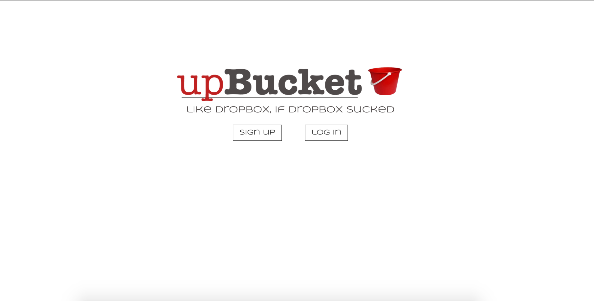
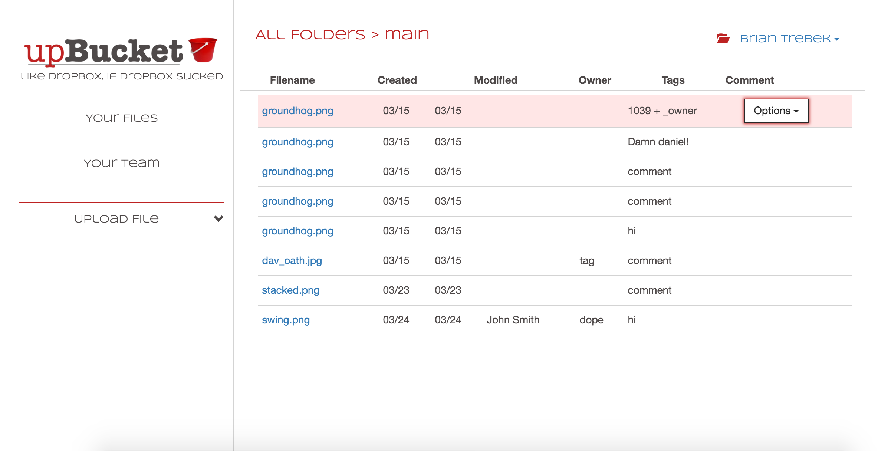

# upBucket client

## Hosted on Github pages

View app/API here: 
  [upBucket Client](http://apalmer0.github.io/upbucket-client/index.html)
   
  [upBucket API](https://pacific-chamber-64011.herokuapp.com)

## About

A basic file-storage system that allows users to save and retrieve
files from Amazon Web
Services. It's a lot like Dropbox, but different... mostly because of the
name.

Currently, a user can create an account and login and logout,
select any
file/filetype from their computer, assign that file to a
folder, give the file 'tags', and then save it to AWS.
Only the file's owner can access those files. Files can be deleted,
but only the record of the file is deleted from the database -
the file itself is not yet deleted from AWS.

Things I would do with more time:

-   Delete files from AWS when they're deleted in the app
-   Create collaborators who can also see the owner's files
-   Create nested folders, if for no other reason than just to see if I can
-   Allow users to filter by the tags they created
-   Add in some new features like subscriptions and ascent recording.

## Front End Mockups

The basic layout of the site was decided early on - unlike my other projects,
I wanted this interface to be extremely clean and minimalistic, with few if any
items to interact with besides the main calls to action.

User login screen:

Main interface:

## Screenshots

Generally speaking, the final version of the app was true to the mockup, which
mapped out the user flow from login to the main/only page of the app.

User login screen:

Main interface:

## Code

-   This app is written using javascript, ajax, bootstrap,
handlebars, html, sass, and css
